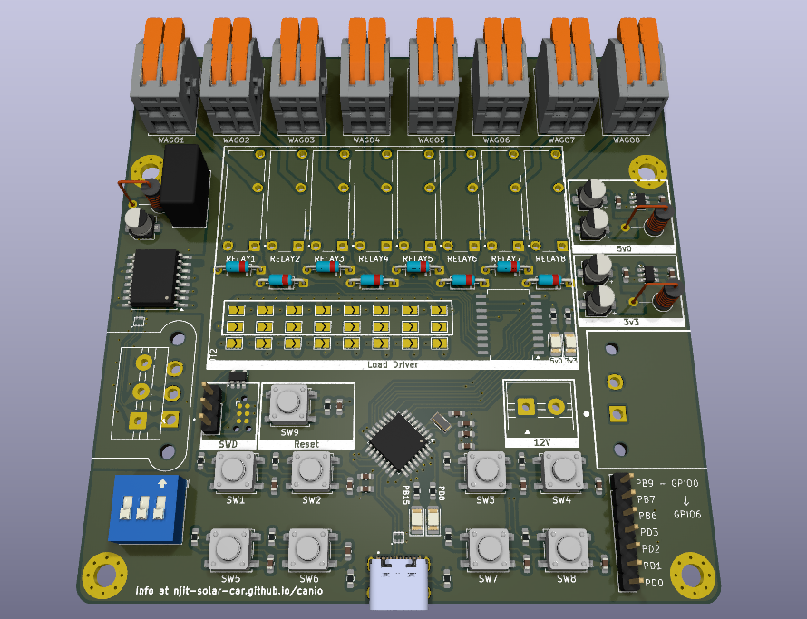

+++
date = '2026-06-19T18:19:43-04:00'
title = 'Portfolio'
+++

# My Portfolio

> Passionate Computer Engineer, with a focus in embedded hardware/software development

## Active Projects


{}

### [CANIO](https://njit-solar-car.github.io/canio)

Developed NJIT Solar Car's CAN IO board, to interface the car's various peripherals with the car's CAN bus. Uses an **STM32G0B1** microcontroller, as well as **isolated CAN Transceiver** to interact with the 1Mbps CAN 2.0A bus.

Currently writing firmware for both the CAN IO board, as well as the car's STM32F413-based central control unit. Find the car at the FSGP competition this July in Minnesota!

{}
- 4 layer PCB with impedance matched CAN and USB traces.
- 8 independent Panasonic SPST-NO relays to drive up to 2A to each of the 8 channels.
- Isolated CAN transceiver (TI ISO1042) using Murata's 5V DC-DC converter, paired with LC filter and LDO.
- Differential pair noise filtering using STM's ECMF02 common mode choke.
- Full details [here](https://njit-solar-car.github.io/canio)

{}

{}
- WIP!!!
- Firmware for both boards uses FreeRTOS for multithreading
- CCU:
    - Vehicle status relayed to base station via the SX127x LoRA communication module
    - 8 independent relays (controlled through GPIO) to control vehicle main contactors, precharge circuitry, and supplemental battery switchover
    - Communication with 2 Kelly KBL motor controllers via CAN 2.0A
- CAN IO:
    - 8 independent relays also controlled through GPIO, controlling headlights, indicators, brake lights, and other miscellaneous peripherals.
{}
{}

{}

### [Go Graphics Virtual Machine](https://github.com/avr34/ggvm)

Developing a stack based virtual machine that supports drawing images, by wrapping the GG library's functions. Effectively, draw images using the GG library without needing to recompile Go code. Lightweight (currently 3MB compiled), somewhat fast, and very nearly *turing complete* (only need indexable variables, coming soon!).

- Currently, the core VM is complete as initially intended. As development progressed, I saw a few extra features it could benefit from (ie, indexable variables; allowing stack reversing functions, and turing completeness).
    - Currently supports stack pushing and popping, loading and storing from a hashmap-based memory (store values from stack to memory based on variable name, not memory address), branching, calling functions (with return address), and importing other files, with naive import loop checking.
    - Currently supports almost half of the GG library's functions; I plan on finishing just the bare, orthogonal instructions as soon as possible, with the full instruction set possibly at some point in the future.

{}

{}

### ESP32 Bootloader

Building a toy bootloader for an ESP32-S3. Inspired by the [toy Rust bootloader](https://youtu.be/l75TfMOPG1g) created by The Rusty Bits on Youtube. Still in very early design phase, but I plan on implementing support for at least a few peripherals (UART, maybe I2C), and also possibly an over-the-air firmware update system via an RF module.

{}


## Past Projects


{}
### [Autonomous Lawnmower](https://github.com/SolarVisionMower/SolarVision)

Group Engineering Capstone project. An autonomous navigation system for lawnmower, utilizing **YOLOv8 segmentation**, **LiDAR**, and **Ultra Wideband Positioning** (UWB) for real-time localization and path planning.

The project boasts *completely custom* hardware and firmware:

{}
- Features a custom board for the **STM32N6** microcontroller, with embedded Neural Processing Unit.
- Additionally, features a custom **Main Board**, hosting the STM32 as well as an ESP32S3 microcontroller, and UWB tag.
- Both designed with KiCAD, fabricated through JLCPCB.
{}

{}
- Utilizes FreeRTOS for concurrency on both, along with custom generated HAL for the STM.
- Custom firmware to interface the LiDAR and UWB on the ESP32.
{}

{}

{}
### [STM32F446-based Logic Analyzer](https://github.com/ragusauce4357/ECE692-Final-Project)

Group project for a Masters Embedded Systems course. STM32F446 based Logic analyzer. Capable of sniffing upto 500kHz signals.

- DMA data acquisition, and run-length encoded data transmission, to optimize byte usage on USB 2.0 FS
- UART, SPI, I2C, and CAN signal decoding via a custom Go backend.
- GUI using PyQt5. Sends and receives data from the STM via the Go backend, using a socket connection.
{}

{}
### [BitSum Lecture Summarizer](https://github.com/avr34/ECE381-Final)

A completely local, docker based AI stack which takes input of audio/video lectures, and transcribes and summarizes them. Uses OpenAI Whisper for transcription, and Microsoft BitNet for efficient CPU-based summaries.
{}
{}
### [NeuralNet](https://github.com/avr34/NeuralNet)

A C library to create, train, and export feed-forward neural networks. It leverages a completely custom (non-hardware accelerated) matrix library for matrix/vector operations, as well as MSE Loss, SGD based backpropagation (using matrix derivatives), and ReLU activation.
{}
{}
### SessionSummary Email Generator

Created a fully custom email generator for the Mathnasium of Chatham + 4 other centers. Utilizes Javascript and Node.js, and custom (effectively reverse-BNF grammar) email generation algorithm to generate 110-150 emails per day.
{}


## Tech Stack

| Category                     | Tools & Languages |
|:-----------------------------|:------------------|
| **Languages:**               | C, C++, MATLAB, Java, Python, Go, SQL (MySQL), GNU Octave, Latex, Javascript, VHDL |
| **Software Tools:**          | Linux (Debian), KiCAD, FreeCAD, STM32CubeMX & IDE, PlatformIO, ESP-IDF, Git, Docker, Excel |
| **Build Tools/Debuggers:**   | Apache Maven, Apache Ant, CMake, Make, MSVC & GCC, GDB, Valgrind |
| **Libraries:**               | STM32 HAL, FreeRTOS, NumPy, PyTorch, Scikit Learn, Matplotlib, Gnuplot |
| **Communication Protocols:** | UART, I2C, SPI, CAN, USB 2.0, TCP and Socket programming in C/C++ and Go |
